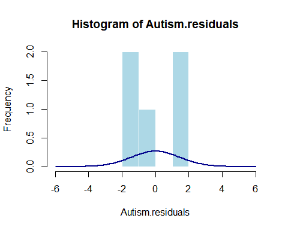
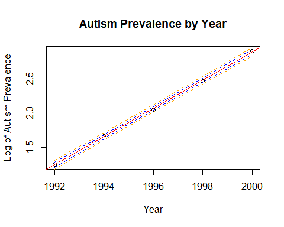

From Problem 29, Chapter 8:
The autism data show the prevalence of autism per 10,000 ten-year-old children in the United States in each of five years. Analyze the data to describe the change in the distribution of autism prevalence per year during this time period. 
	Use alpha = 0.05.
	Use R for this problem. 
	Include relevant code and output. Make sure you directly answer the questions. Do NOT assume the answer is obvious in the output.
Specifically, provide/answer the following:

Address all the assumptions for a linear regression model prior to the analysis. If the assumptions are not met, handle the data appropriately. If a transformation is used, address the assumptions again with the transformed data to ensure that the transformation is logical. The questions below should reflect this. For example, you should include a scatter plot for the original data AND transformed data, etc. (Hint: if a transformation is necessary, try one of the transformations discussed in class first.) At minimum, provide and interpret the following elements to address assumptions FOR THE ORIGINAL DATA AND ANY TRANSFORMED DATA (IF you use a transformation). You may include more graphs if you find them useful.

A scatterplot with the following included on the graph: regression line, confidence intervals of the regression line, and prediction intervals of the regression line.
	

```r
Autism.lm<-lm(Prevalence~Year,data = Autism_Data_Prob_29)
#summary(Autism.lm)
#qt(0.995, 198)
#abs(qt(0.01/2, 198))
#confint(MaleTest.lm, level = .99)

NewYear=sort(Autism_Data_Prob_29$Year)

prd_c=predict(Autism.lm, newdata= data.frame(Year = NewYear), interval=c("confidence"), type = c("response"), level=0.95)

prd_p=predict(Autism.lm, newdata= data.frame(Year = NewYear), interval=c("prediction"), type = c("response"), level=0.95) 

plot(x=Autism_Data_Prob_29$Year,y=Autism_Data_Prob_29$Prevalence, ylim = c(-5,25),xlab = "Year",ylab = "Autism Prevalence", main = "Autism Prevalence by Year")
abline(Autism.lm, col = "red")
lines(NewYear,prd_c[,2],col = "blue",lty = 2, lwd = 1)
lines(NewYear,prd_c[,3],col = "blue",lty = 2, lwd = 1)
lines(NewYear,prd_p[,2],col = "orange",lty = 2, lwd = 1)
lines(NewYear,prd_p[,3],col = "orange",lty = 2, lwd = 1)
```

<!-- -->

ii.	A scatterplot of residuals.


```r
Autism.residuals<- resid(Autism.lm)
plot(Autism_Data_Prob_29$Year, Autism.residuals, xlab = "Year",ylab = "Autism Prevalence Residuals", main = "Autism Prevalence Residuals by Year")
```

<!-- -->
iii.	A histogram of residuals with the normal distribution superimposed.


```r
m<-mean(Autism.residuals)
std<-sqrt(var(Autism.residuals))
hist(Autism.residuals, breaks=4,xlim = c(-6,6),col = "lightblue",border = "white")
curve(dnorm(x, mean=m, sd=std),
col="darkblue", lwd=2, add=TRUE, yaxt="n")
```

<!-- -->
iv.	A discussion supporting the use of the model you chose (support that the assumptions are met).


```r
#Add Log of Prevalence to the DataFrame
Autism_Data_Prob_29<-cbind(Autism_Data_Prob_29, log(Autism_Data_Prob_29$Prevalence))
names(Autism_Data_Prob_29)<-cbind("Year","Prevalence","logPrevalence")
Autism.lm<-lm(logPrevalence~Year,data = Autism_Data_Prob_29)
#Create Prediction and Confidence Interval Lines
NewYear=sort(Autism_Data_Prob_29$Year)
prd_c=predict(Autism.lm, newdata= data.frame(Year = NewYear), interval=c("confidence"), type = c("response"), level=0.95)
prd_p=predict(Autism.lm, newdata= data.frame(Year = NewYear), interval=c("prediction"), type = c("response"), level=0.95) 
#fit/scatter
plot(x=Autism_Data_Prob_29$Year,y=Autism_Data_Prob_29$logPrevalence, xlab = "Year",ylab = "Log of Autism Prevalence", main = "Autism Prevalence by Year")
abline(Autism.lm, col = "red")
lines(NewYear,prd_c[,2],col = "blue",lty = 2, lwd = 1)
lines(NewYear,prd_c[,3],col = "blue",lty = 2, lwd = 1)
lines(NewYear,prd_p[,2],col = "orange",lty = 2, lwd = 1)
lines(NewYear,prd_p[,3],col = "orange",lty = 2, lwd = 1)
```

<!-- -->

```r
#scatter residuals
Autism.residuals<- resid(Autism.lm)
plot(Autism_Data_Prob_29$Year , Autism.residuals, xlab = "Year",ylab = "Log of Autism Prevalence Residuals", main = "log of Autism Prevalence Residuals by Year")
```

<!-- -->

```r
#Residuals histogram using log of Year
m<-mean(Autism.residuals)
std<-sqrt(var(Autism.residuals))
hist(Autism.residuals, xlim = c(-.05, .05),ylim = c(0, 2.5),col = "lightblue",border = "white")
curve(dnorm(x, mean=m, sd=std),
col="darkblue", lwd=2, add=TRUE )
```

<!-- -->

Once a reasonable model is found (possibly using a transformation), provide a table showing the t-statistics and p-values for the significance of the regression parameters β_(0 ) and β_1.


```r
summary(Autism.lm)
```

```
## 
## Call:
## lm(formula = logPrevalence ~ Year, data = Autism_Data_Prob_29)
## 
## Residuals:
##         1         2         3         4         5 
##  0.004578  0.008655 -0.015795 -0.012686  0.015248 
## 
## Coefficients:
##               Estimate Std. Error t value Pr(>|t|)    
## (Intercept) -4.080e+02  4.953e+00  -82.38 3.94e-06 ***
## Year         2.054e-01  2.481e-03   82.79 3.88e-06 ***
## ---
## Signif. codes:  0 '***' 0.001 '**' 0.01 '*' 0.05 '.' 0.1 ' ' 1
## 
## Residual standard error: 0.01569 on 3 degrees of freedom
## Multiple R-squared:  0.9996,	Adjusted R-squared:  0.9994 
## F-statistic:  6855 on 1 and 3 DF,  p-value: 3.884e-06
```


	The estimate regression equation. Make sure the dependent variable is noted as the predicted value or predicted mean value, not just the dependent variable.
	Interpretation of the model, paying special attention if you used a transformation (hint!). That is, interpret the slope as well as the confidence interval. 
	A measure of the proportion of variation in the response that is accounted for by the explanatory variable. Interpret this measure clearly.
	


